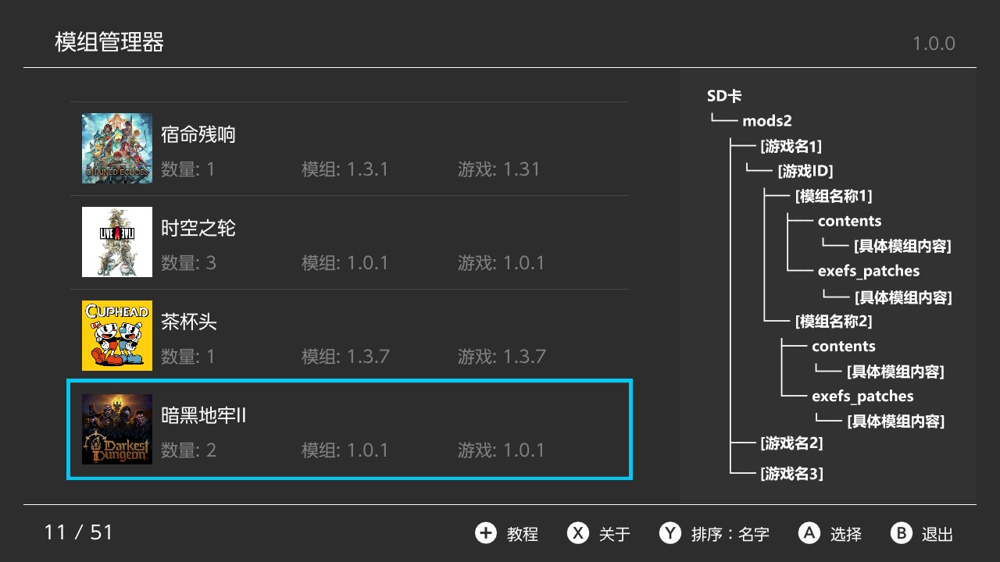
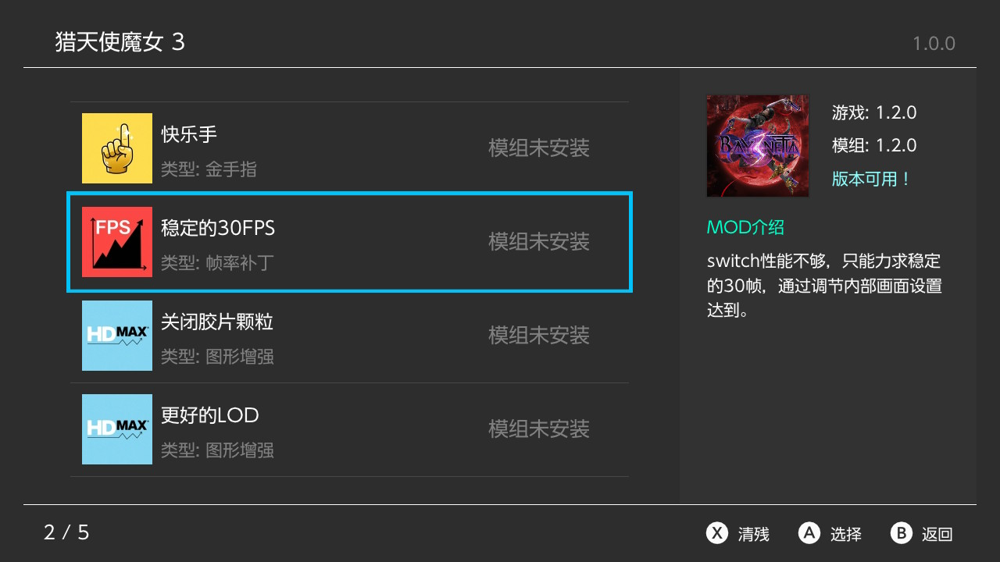
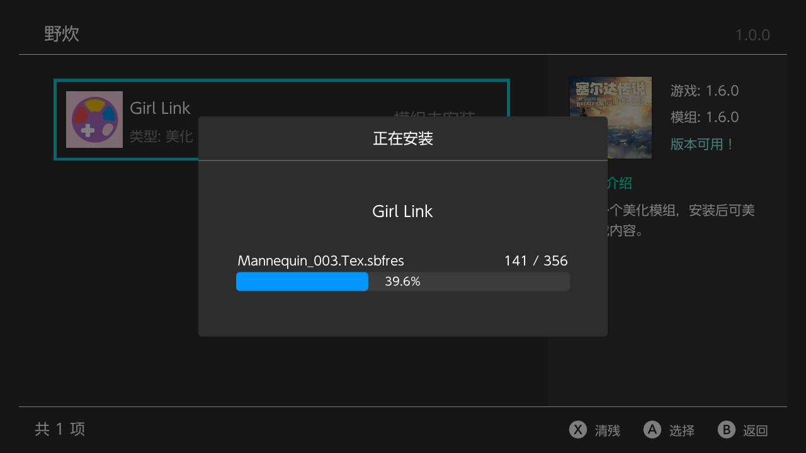
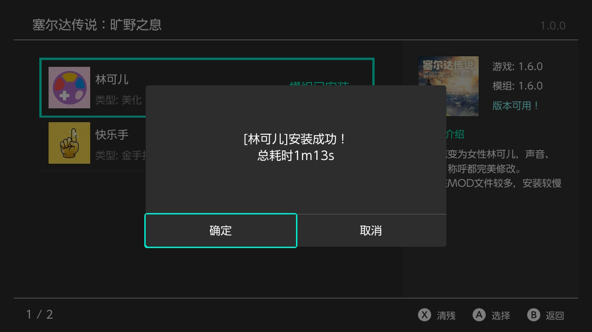
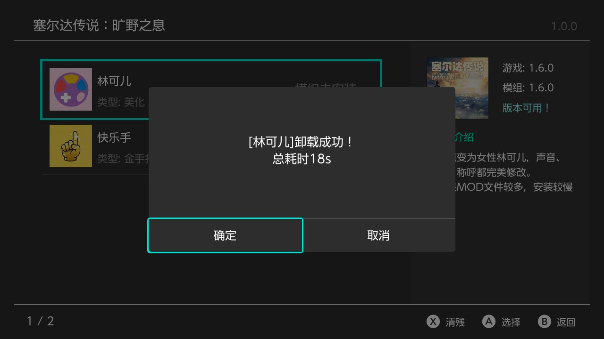

# NX Mod Manager

[中文](./README.md) [English](./README_EN.md)

A mod manager designed specifically for Nintendo Switch, supporting multi-language interface, audio feedback, name mapping, and providing intuitive mod installation, uninstallation, and management functions.

MODs are installed using copy method. For large MODs, the installation speed is slower, but considering the convenience of backing up the MODS2 folder, the copy installation method is adopted.

The plugin supports local data caching, and for 20+ systems, except for the slower initial scan, subsequent entries can load extremely fast.

## Installation Speed

**Note**: Starting from version 2.0, this plugin only supports installing ZIP-type MODs. Manual installation methods are not affected.
**Note**: File installation functionality will not be deleted, just no longer updated and maintained.

**Note**: The first level inside the ZIP package must be `contents` and `exefs_patches`, otherwise it cannot be recognized. The name of the ZIP package does not matter.
**Note**: ZIP compression should use standard format. Only ZIP format is supported, 7z\RAR formats are not supported.

**Taking Lin Ke'er mod as an example, 2700+ files, 500MB.**

File-based installation time: 1-1 minute 20 seconds, uninstallation time: 15-20 seconds.

ZIP-based installation time: 1-1 minute 20 seconds, uninstallation time: 15-20 seconds.

**Taking Princess Flower mod as an example, 13805 files, 1.15GB.**

File-based installation time: 7 minutes 10 seconds, uninstallation time: 1 minute 30 seconds.

ZIP-based installation time: 4 minutes 50 seconds - 5 minutes 03 seconds, uninstallation time: 1 minute 30 seconds.

## Usage

After downloading and running the plugin, it will automatically create a mods2 folder for storing MODs. It will also automatically create a /mods2/0000-add-mod-0000 folder for placing ZIP-type MODs to be installed.

Place ZIP-type MODs into the /mods2/0000-add-mod-0000 folder, open the plugin, and follow the function prompts for normal use.

**Note**: The newly added plugin installation function only supports ZIP-type MODs.

**Note**: ZIP names can only contain English letters and numbers.

**Note**: The first level inside the ZIP package must be `contents` and `exefs_patches`, otherwise it cannot be recognized.

For more complex but faster batch installation manual configuration methods, see the tutorial below.

## Interface Screenshots












### Complete Directory Structure

The following is a complete directory structure example of mods in the SD card:

```
SD Card
└── mods2
    ├── game_name.json                                          # Game name mapping file
    ├── [Game Name 1][Version Tag]
    │   └── [Game ID]
    │       ├── mod_name.json                                   # Mod name mapping file
    │       ├── [Mod Name 1][Mod Type Tag]
    │       │   ├── contents
    │       │   │   └── [Specific mod content]
    │       │   └── exefs_patches
    │       │       └── [Specific mod content]
    │       └── [Mod Name 2][Mod Type Tag]
    │           ├── contents
    │           │   └── [Specific mod content]
    │           └── exefs_patches
    │               └── [Specific mod content]
    │ 
    ├── [Game Name 2][Version Tag]
    │   └── [Game ID]
    │       ├── mod_name.json                                    # Mod name mapping file
    │       └── [Mod Name][Mod Type Tag]
    │           └── MOD.ZIP                                      # New ZIP MOD format support
    │               └── contents ── [Specific mod content]
    │               └── exefs_patches
    │                       └── [Specific mod content]
    │ 
    └── [Game Name 3][Version Tag]
        └── [Game ID]
            ├── mod_name.json                                    # Mod name mapping file
            └── [Mod Name][Mod Type Tag]
                ├── contents
                │   └── [Specific mod content]
                └── exefs_patches
                    └── [Specific mod content]
```

**Directory Structure Description**:
- Each game can have multiple mods
- Each mod can contain both `contents` and `exefs_patches` types
- Added ZIP MOD format support. ZIP packages are placed under the MOD name directory. The first level inside the ZIP package must be `contents` and `exefs_patches`, otherwise it cannot be recognized.

### Mod Directory Text Description

Mod usage directory: `SD Card/mods2`

Complete mod path format:
```
mods2/Game Name[Mod Version Tag]/Game ID/Mod Name[Mod Type Tag]/Specific mod files
```

**Important Notes**:
- Because the Switch file system does not support Chinese, the entire path uses English and numbers, including punctuation, otherwise it cannot be recognized
- Multiple mods can be placed under the game ID path, such as: Mod Name 1[Mod Type Tag], Mod Name 2[Mod Type Tag]
- If tags are not marked on the path, it does not affect actual use, but it is recommended to mark them for easy management

### Tag Format Description

**Version Tag Format**: `[Version Number]`
- Please fill in the mod version tag according to the actual applicable version of the mod, only numbers are needed
- Example: V1.2.0 written as `[1.2.0]`

**Mod Type Tags**:
| Tag  | Meaning     |
| ---- | -------- |
| [F]  | Frame rate patch |
| [G]  | Graphics enhancement |
| [B]  | Game beautification |
| [P]  | More gameplay |
| [C]  | Cheat codes   |

**Note:** Tag format is `[X]`, where X is the tag content. To avoid recognition errors, please do not use `[]` brackets for non-tag content in the path.

### Mod Type Examples

**Contents Mod Example**:
```
Sentinels[1.0.0]/01008D7016438000/cheat code[C]/contents/01008D7016438000/cheats/F64F574.txt
```

**Exefs_patches Mod Example**:
```
Bayonetta[1.2.0]/01004A4010FEA000/720&900[G]/exefs_patches/Bayo3/F00DF.ips
```

**New ZIP MOD Format Support**:
```
Sentinels[1.0.0]/01008D7016438000/cheat code[C]/MOD.ZIP
```

**Note**: The first level inside the ZIP package must be `contents` and `exefs_patches`, otherwise it cannot be recognized. The name of the ZIP package does not matter.

### Name Mapping Configuration

#### Game Name Mapping

The mapped name will replace the original file directory name displayed in the program.

**File Path**: `SD/mods2/game_name.json` 

**Format**:
```json
{
  "Game folder name": "Desired mapped name"
}
```

**Example**:
```json
{
  "Celeste[1.0.0]": "Celeste",
  "Bayonetta 3[1.2.0]": "Bayonetta 3"
}
```

#### Mod Name Mapping

**File Path**: `SD Card/mods2/Game folder name[Mod version tag]/Game ID/mod_name.json`

**Format**:
```json
{
  "Mod folder name": {
    "display_name": "Desired mapped name",
    "description": "Mod description"
  }
}
```

**Example**:
```json
{
  "FPS-60[F]": {
    "display_name": "Stable 30FPS",
    "description": "More detailed graphics adjustments to help the game maintain stable 30FPS and improve gaming experience."
  },
  "720&900[G]": {
    "display_name": "More Resolutions",
    "description": "Adjust game resolution to handheld 720p, docked 900p, improving image quality."
  }
}
```

**Note**: When editing mapping files, pay attention to the position of braces and the correctness of JSON format.

## Project Structure

```
SSM2/
├── src/                          # Source code directory
│   ├── app.cpp/hpp               # Main application class
│   ├── main.cpp                  # Program entry point
│   ├── audio_manager.cpp/hpp     # Audio manager
│   ├── lang_manager.cpp/hpp      # Multi-language manager
│   ├── async.hpp                 # Async processing tools
│   ├── nanovg/                   # NanoVG graphics library
│   ├── yyjson/                   # JSON parsing library
│   └── utils/                    # Utility classes
│       └── logger.cpp/hpp        # Logging system
├── assets/                       # Asset files
│   ├── icon.jpg                  # Application icon
│   └── romfs/                    # RomFS resources
│       ├── lang/                 # Multi-language files
│       ├── *.jpg                 # Mod type icons
│       └── shaders/              # Shader files
├── lib/                          # Third-party libraries
│   ├── switch-libpulsar/         # Audio library
│   └── libnxtc-add-version/      # Title cache library
├── Makefile                      # Build configuration
└── README.md                     # Project documentation
```

### Build Steps

1. **Clone Project**:
   ```bash
   git clone <https://github.com/TOM-BadEN/NX-Mod-Manager.git>
   cd SSM2
   ```

2. **Compile Project**:
   ```bash
   make
   ```

3. **Output Files**:
   - `NX-Mod-Manager.nro`: Executable file

## Acknowledgments

Thanks to the following open source projects and libraries for their contributions:
| Project | Link | Description |
| ------- | ---- | ----------- |
| untitled | [ITotalJustice/untitled](https://github.com/ITotalJustice/untitled) | ITotalJustice untitled |
| libhaze | [ITotalJustice/libhaze](https://github.com/ITotalJustice/libhaze) | ITotalJustice libhaze |
| haze | [Atmosphere-NX/haze](https://github.com/Atmosphere-NX/Atmosphere/tree/master/troposphere/haze) | Atmosphere-NX haze |
| devkitPro | [devkitPro](https://devkitpro.org/) | Nintendo Switch development toolchain |
| libnx | [switchbrew/libnx](https://github.com/switchbrew/libnx) | Switch system library providing low-level API support |
| deko3d | [devkitPro/deko3d](https://github.com/devkitPro/deko3d) | Switch GPU graphics API for high-performance rendering |
| NanoVG | [memononen/nanovg](https://github.com/memononen/nanovg) | Lightweight 2D vector graphics library |
| switch-libpulsar | [p-sam/switch-libpulsar](https://github.com/p-sam/switch-libpulsar) | Switch audio playback library |
| fontstash | [memononen/fontstash](https://github.com/memononen/fontstash) | Font rendering library |
| yyjson | [ibireme/yyjson](https://github.com/ibireme/yyjson) | High-performance JSON parsing library |
| libnxtc | [DarkMatterCore/libnxtc](https://github.com/DarkMatterCore/libnxtc) | Title cache management library (this project uses libnxtc-add-version with added version member) |
| stb | [nothings/stb](https://github.com/nothings/stb) | Image processing library |
| miniz | [richgel999/miniz](https://github.com/richgel999/miniz) | Compression library |
